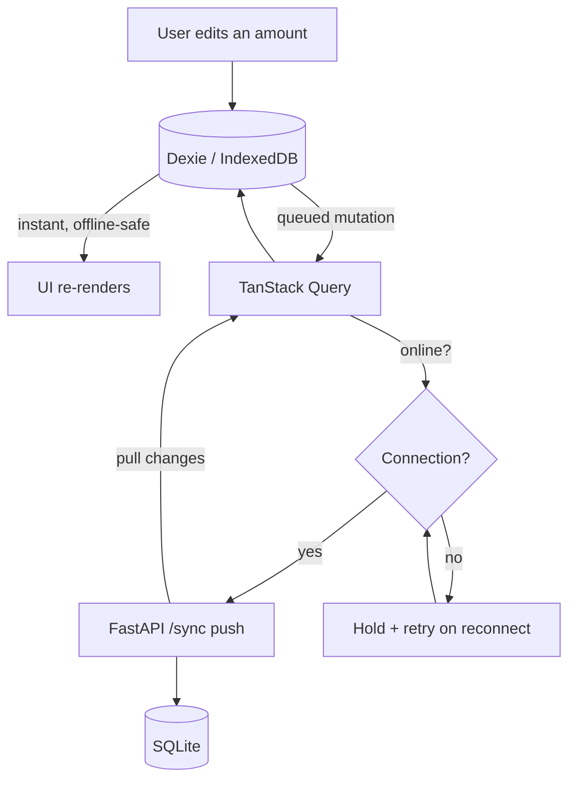
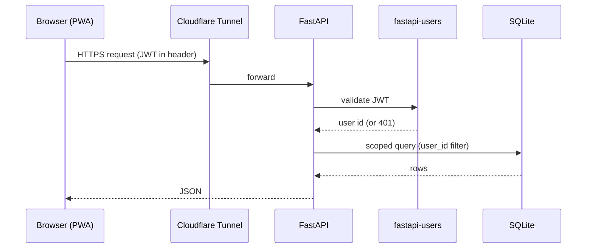
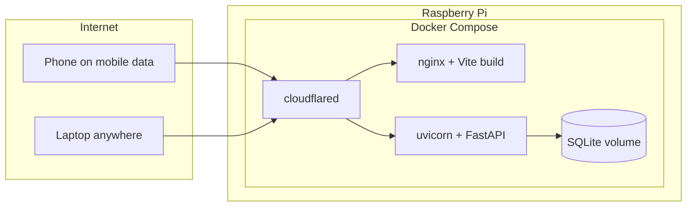

# Architecture — Cuentas

## The short version

Cuentas is a **modular monolith** with a **pragmatic, DDD-lite** internal design. One deployable backend, one frontend bundle, organized into feature modules with the domain logic kept clean and framework-free. It is deliberately *not* full Domain-Driven Design, and the reasoning for that is written down below rather than assumed — because "modular monolith with DDD" was the starting proposal, and one half of it didn't survive contact with the actual domain.

---

## Decision record: modular monolith — yes; full DDD — no

### Monolith: correct

For a single-household app hosted on a Raspberry Pi and forked by hobbyists, a monolith is the obvious right answer. Microservices would add network hops, deployment complexity, and operational overhead to solve a scaling problem that doesn't exist here. One backend process, one database file, one `docker compose up`. Nobody self-hosting a budget app on a Pi wants to orchestrate five containers to track their groceries.

### Modular: correct, kept lightweight

"Modular" here means the code is organized by feature (budgeting, identity, layout, sync) rather than by technical layer (all controllers together, all models together). This matters more for an open-source project than for a private one: a contributor who wants to fix the category logic should find everything about categories in one place, not spread across four type-based folders. The modularity is a folder convention, not an enforced module system with compile-time boundaries. Keep it as light as the app is small.

### Full DDD: rejected — the domain doesn't justify it

Domain-Driven Design's tactical patterns — aggregates, aggregate roots, repositories behind interfaces, domain services, application services, domain events, bounded contexts, anti-corruption layers — exist to tame *complex* domains: ones with intricate invariants, evolving business rules, and multiple teams speaking a shared language. Insurance underwriting. Logistics routing. Trading systems.

This app's domain is arithmetic:

```
income.total       = nomina + otros + Σ extras
canSpend           = income.total − savingsGoal
expenses.total     = Σ fixed + Σ variable
endOfMonthSavings  = income.total − expenses.total
year               = aggregation over 12 months
```

Walk through what full DDD would actually add here:

- **Aggregates and aggregate roots** protect invariants that span multiple entities. There are almost none. A month is a bag of numbers that sum; nothing breaks if you edit one line without a transaction boundary guarding the others.
- **Domain events** exist so one part of a system can react to changes in another. Who subscribes? Nothing. There is no consumer. The events would be published into the void as pure ceremony.
- **Repositories behind interfaces** abstract the persistence layer so the domain doesn't depend on it. SQLModel is already that abstraction. Wrapping it in hand-written repository interfaces is a second abstraction over the first — indirection with no payoff.
- **Application-service layers** that just delegate to domain services that just call repositories become passthrough boilerplate. Three files to save a number.

The concrete cost of all this is the contribution barrier. Open-source contributors abandon projects where adding a field to a form means a coordinated edit across six files in three layers. For a project whose whole point is being forkable, that friction is the opposite of the goal.

**Verdict:** keep the monolith, keep the light modularity, and take only the two DDD ideas that genuinely pay off here.

### What DDD-lite keeps

1. **A pure, framework-free domain core.** The `computeMonth` / `computeYear` functions already in `Presupuesto.tsx` are, in DDD terms, the domain layer done right: no framework, no I/O, just the rules. This is the one piece worth protecting and testing hard. It's the actual product; everything else is plumbing.

2. **Money as a value object.** Currency-aware arithmetic is the single place this app has a real invariant worth enforcing: you must never add 100 EUR to 100 USD as if they were the same number. A small `Money { amount, currency }` type with explicit conversion is the one tactical DDD pattern that earns its keep. Adopt it on both sides.

3. **Ubiquitous language.** The domain already speaks Spanish — `nomina`, `ahorro`, `gastos fijos`. Keep that vocabulary consistent across the codebase, the API, and the UI. Consistent naming is the cheap, high-value half of DDD; take it and skip the rest.

### What DDD-lite drops

Repository interfaces (use SQLModel directly), domain events (no subscribers), application-service ceremony, strict hexagonal layering, bounded-context machinery. If this app ever grows a genuinely complex sub-domain, revisit — but adding structure to fit a future that may never arrive is how simple apps die of architecture.

---

## Module layout

```
cuentas/
├── frontend/
│   └── src/
│       ├── modules/
│       │   ├── budgeting/     # months, entries, categories, the compute core
│       │   ├── dashboard/     # widget catalog + customizable layout
│       │   ├── identity/      # login, session
│       │   └── sync/          # Dexie ↔ backend reconciliation
│       ├── shared/            # Money value object, formatters, UI primitives
│       └── db/                # Dexie schema
│
└── backend/
    └── app/
        ├── modules/
        │   ├── budgeting/     # entries, categories, aggregation endpoints
        │   ├── identity/      # fastapi-users wiring
        │   ├── layout/        # widget-layout persistence
        │   └── sync/          # push/pull endpoints
        ├── shared/            # Money, currency conversion, common deps
        └── core/              # config, db session, migrations
```

Each backend module is a small vertical slice: its routes, its SQLModel tables, its logic. No shared "models.py" dumping ground. A contributor working on categories opens `modules/budgeting/` and finds everything.

---

## Offline-first data flow

The frontend never waits on the network to feel responsive. Writes hit IndexedDB first and reconcile with the backend in the background.



**Source of truth on-device:** Dexie. **Source of truth across devices:** SQLite, reconciled via the sync endpoints. Conflict resolution is last-write-wins on an `updated_at` timestamp — correct enough for single-user, single-household editing, where genuine concurrent edits to the same field on two devices are rare. No CRDTs; they'd be solving a problem this usage pattern doesn't create.

---

## Request lifecycle (online)



Every query is scoped by `user_id`. User isolation is enforced at the data-access boundary, not assumed — the one security invariant this app cannot get wrong, since it's financial data.

---

## Deployment topology



Cloudflare Tunnel is the only ingress. No ports opened on the router, no home IP exposed, TLS handled by Cloudflare. The SQLite volume is the one piece of durable state — back it up off-device (see `TECH_STACK.md`).

---

## Where this architecture bends if the app grows

Honest limits, so nobody's surprised later:

- **Shared households (v2).** Introduces the first real invariant worth an aggregate: a household budget several users edit. That's when a slightly heavier domain model in the budgeting module becomes justified — not before.
- **Concurrent editing at scale.** Last-write-wins breaks down if many users edit the same records simultaneously. Single-household use won't hit this; a fork serving many users might, and that's the point to reconsider sync strategy.
- **SQLite under real concurrency.** Fine for one household. A multi-tenant fork should switch to Postgres — a connection-string change, by design.

The architecture is sized to the app as it actually is today. That's the point.
