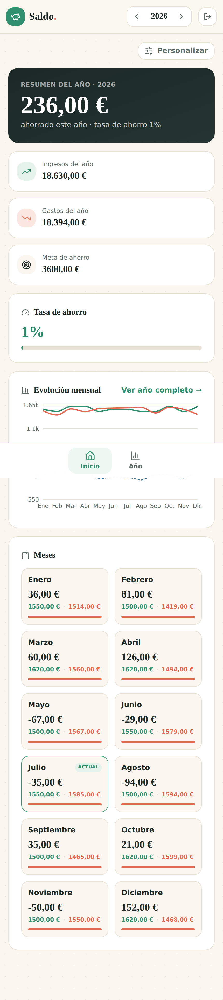
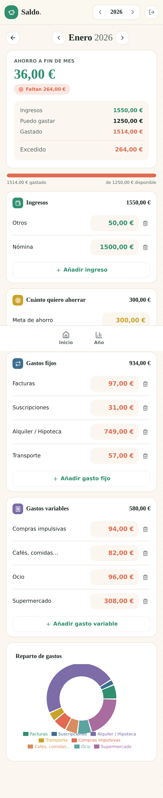
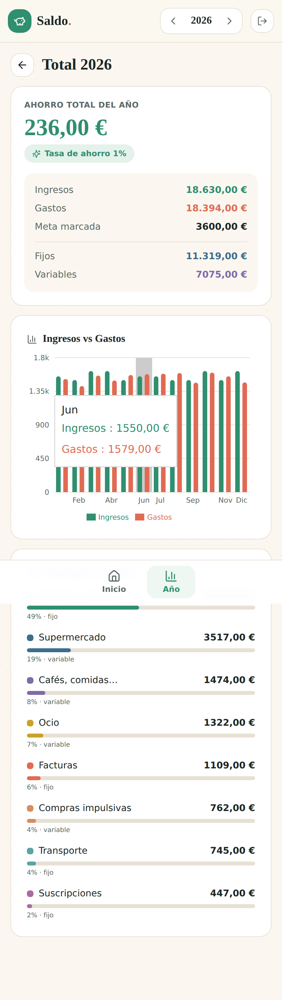

<div align="center">


# Saldo

**Offline-first, self-hosted personal finance.**
Manual entry · multi-user · multi-currency. Built to run on a Raspberry Pi and be forked by anyone.

</div>

Saldo is a rebuild of a single-file budgeting prototype
(`reference/Presupuesto.tsx`) into a proper, contributable application. The
domain speaks Spanish by design — `nomina` (payroll), `otros` (other income),
`gastos fijos` / `gastos variables` (fixed / variable expenses), `ahorro`
(savings) — the vocabulary of the spreadsheet it grew from.

---

## Screenshots

| Dashboard | Month | Year |
|---|---|---|
|  |  |  |

<div align="center"><em>The customizable dashboard, a month's editable budget with its spending breakdown, and the year overview.</em></div>

---

## Why Saldo

- **Offline-first, for real.** Installed as a PWA, it opens and stays fully
  interactive with zero connectivity. Every write lands in IndexedDB first;
  syncing to the server is a background concern that never blocks you.
- **Yours to host.** One `docker compose up` on a Pi (or any box). SQLite in a
  named volume — trivial to back up, trivial to move. Reachable from anywhere via
  Cloudflare Tunnel, with no ports opened and no home IP exposed.
- **Multi-user & multi-currency.** Real auth from day one; every query is scoped
  to the authenticated user (it's financial data). Entries carry an ISO-4217
  currency, converted for display only when a view mixes currencies.
- **Forkable.** A modular monolith with a pure, framework-free domain core and no
  ceremony. Adding a field doesn't mean editing six files across three layers.

## Architecture at a glance

- **Frontend** — React + Vite + TypeScript; offline shell via vite-plugin-pwa
  (Workbox). **Dexie (IndexedDB)** is the on-device source of truth;
  **TanStack Query** owns the sync loop; **Zustand** holds the session/theme;
  **dnd-kit** powers the customizable dashboard; **Tailwind** carries the
  "Cuaderno" palette; **Recharts** + **lucide-react** for charts/icons.
- **Backend** — **FastAPI** + **SQLModel** + **SQLite**, a modular monolith. A
  pure domain core (`computeMonth` / `computeYear`) and a currency-aware `Money`
  value object live framework-free in `shared/domain`, mirrored on both sides.
- **Auth** — email + password (argon2, JWT) via fastapi-users.
- **Infra** — Docker Compose (nginx + uvicorn + Cloudflare Tunnel), a named
  volume for SQLite, multi-arch (arm64 + amd64) images published to GHCR.

The full reasoning — including which alternatives were rejected and why — is in
[`TECH_STACK.md`](TECH_STACK.md) and [`ARCHITECTURE.md`](ARCHITECTURE.md). Read
those two before proposing a stack change.

---

## Quick start (Docker)

```bash
git clone https://github.com/DiegoDoug/Saldo.git
cd Saldo
cp .env.example .env
# set a strong secret:
python -c "import secrets; print(secrets.token_urlsafe(48))"   # -> SALDO_JWT_SECRET
docker compose up --build
```

- Frontend: <http://localhost:8080>
- Backend API + docs: <http://localhost:8000/docs>

The backend applies migrations on startup, and the `cloudflared` service idles
until you give it a tunnel token — local dev needs no tunnel. For exposing it to
the internet and Raspberry Pi notes, see [`docs/DEPLOYMENT.md`](docs/DEPLOYMENT.md).

## Local development (without Docker)

```bash
# Backend
cd backend
python3 -m venv .venv && . .venv/bin/activate
pip install -r requirements-dev.txt
export SALDO_DATABASE_URL="sqlite:///./data/saldo.db"
mkdir -p data && alembic upgrade head
uvicorn app.main:app --reload            # http://localhost:8000/docs

# Frontend (in another shell)
cd frontend
npm install
VITE_API_BASE_URL="http://localhost:8000" npm run dev   # http://localhost:5173
```

## Tests & lint

```bash
# Backend
cd backend && pytest && ruff check .

# Frontend
cd frontend && npm run typecheck && npm test
```

The compute functions (`computeMonth` / `computeYear`) have the highest test
coverage in the codebase, deliberately — they're the actual product. The Python
and TypeScript cores are tested against the same expected numbers.

## Repository layout

```
saldo/
├── backend/        FastAPI app (modular monolith: identity, budgeting, sync, layout)
├── frontend/       Vite + React + TS app (modules mirror the backend)
├── reference/      Presupuesto.tsx — the original prototype (source of truth)
├── ops/            backup.sh — nightly SQLite -> S3 backup
├── docs/           PROGRESS.md, DEPLOYMENT.md, screenshots
├── TECH_STACK.md   Stack decisions and rejected alternatives
└── ARCHITECTURE.md Modular-monolith / DDD-lite design record
```

## Contributing

Contributions welcome — see [`CONTRIBUTING.md`](CONTRIBUTING.md). The build log
in [`docs/PROGRESS.md`](docs/PROGRESS.md) tracks what's been built stage by
stage.

## License

[MIT](LICENSE).
